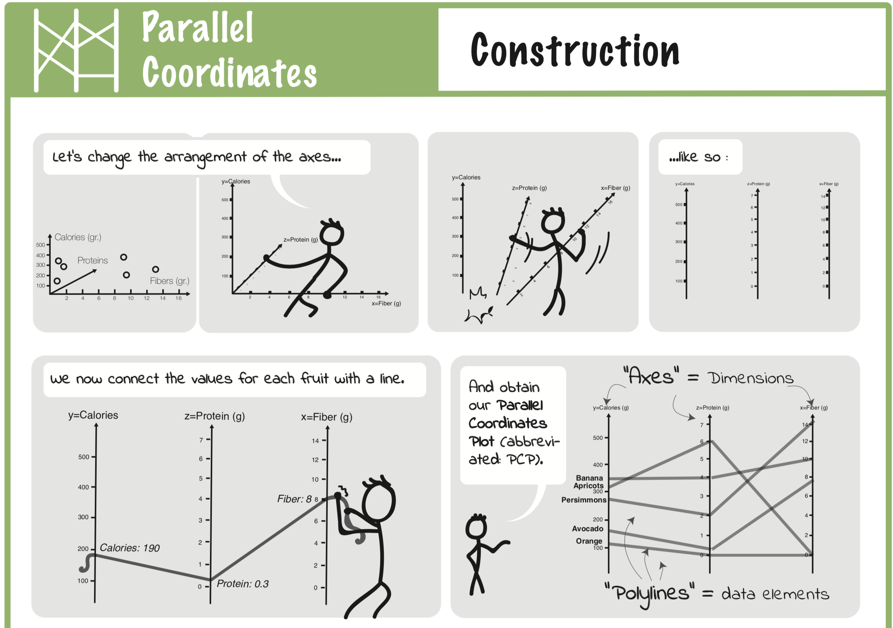
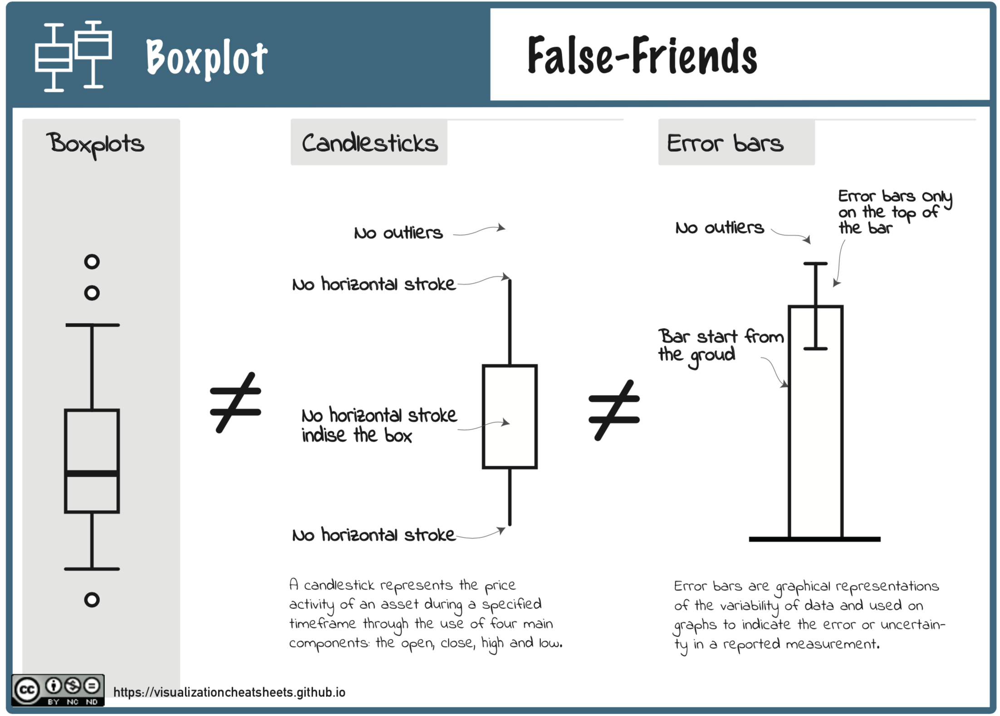

# Cheat Sheets for Visualization Techniques

<iframe width="100%" height="100%" src="https://www.youtube.com/embed/SfSgIvn-99U" frameborder="0" allow="accelerometer; autoplay; encrypted-media; gyroscope; picture-in-picture" allowfullscreen></iframe>

Cheat sheets are sets of _concise graphical and textual explanations_, inspired by infographics, data comics, and cheat sheets in other domains. Cheat sheets aim to support learning, teaching, and the regular use of both common and novel visualization techniques in a variety of contexts. To design cheat sheets for visualization techniques, we describe six components of a cheat sheet: anatomy, build-up, visual patterns, pitfalls, false-friends, variations. We present examples for several visualization techniques, created through an iterative design process which involved data science and visualization teachers, visual designers and students. In a qualitative and iterative user study, we gather subjective feedback from participants, show readability and usefulness of our cheat sheets, and iterated on their design. We bring this together as a design methodology, with a comprehensive design framework to easily create cheat sheets for additional visualizations. 

# By Type

## Anatomy

Anatomy explains the visual elements of a visualization technique, their composition, their specific terminology, and how they relate to the data. The visual components of a visualization can include individual visual marks as well as groups of marks, axes, locations in a visualization etc.

## Construction

A Construction explains the conceptual idea behind a visualization design and how a visualization is encoding data. We chose that term to highlight the step-wise explanation used to understand a visual mapping, i.e. the transformation from data to visualization. The goal of the construction, on the other side, are twofold: (a) to provide a procedural explanation of a visualization design, (b) to deliver a blue-print for how to explain the visualization to a larger audience. 

## Visual Patterns

Visual patternssheet provide a catalogue of meaningful patterns visible in a visualization. Patterns are key in correctly interpreting visualizations and makingdiscoveries.  A visual pattern can be any sort of configuration inthe visualization with a specific meaning.

## Pitfalls 

Pitfalls show possible misinterpretations of a visualization. While there is a long list of technique independent pitfalls.

## Well-known Relative

The “well-known relative” relates an unknown visualization to a more familiar one used to visualize the same data.

## False Friends

False-friendslists visualization techniques that are visually similar but functionally different. For example, boxplots share visualsimilarities with candlestick charts and error bars in bar chars; parallel coordinates can look similar to line charts, time curvescan look similar to connected scatter plots.

# By Visualization

